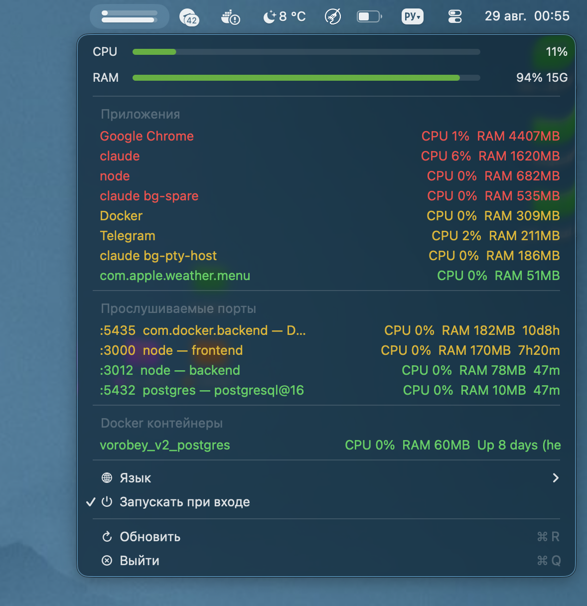

# Resource Monitor

*[Русская версия](README.md)*

A lightweight macOS menu bar utility that shows what's actually eating your memory and CPU — and helps catch background processes left running: dev servers on ports, Docker containers, stuck apps.

The idea is simple: active development on a Mac tends to pile up background processes — dev servers, Docker containers — that keep running after you switch between projects and quietly eat resources until the whole system starts lagging.

One menu bar icon, no third-party dependencies (SwiftBar and the like) — a native Swift/AppKit app.

## Screenshots



## What it shows

- **CPU / RAM** — overall system load, as progress bars
- **Applications** — top consumers by memory/CPU, grouped by the actual app (all of Chrome's processes show as one line instead of a dozen helper processes)
- **Listening ports** — which process is on which port, how much it's using, how long it's been running, and (if it's a dev server) which project folder it was launched from
- **Docker containers** — the same, for running containers

Each row is color-coded by resource usage:
- 🟢 green — all good
- 🟡 yellow — 150MB+ RAM or 15%+ CPU — worth a look
- 🔴 red — 500MB+ RAM or 50%+ CPU — worth checking if it's still needed

## What you can do right from the menu

- **Kill** a process listening on a port
- **Stop** a Docker container
- **Quit** an app (a proper AppleScript quit, not `kill -9` — the app may prompt to save unsaved work)
- Switch the interface language (Russian / English)
- Enable launch at login

## Requirements

- macOS 13.0+ (needed for launch-at-login via `SMAppService`)
- Docker — optional; if it's not installed, that section just shows "not found"

## Building

No Xcode project, plain `swiftc`:

```bash
swiftc -O -o ResourceMonitor.app/Contents/MacOS/ResourceMonitor main.swift -framework Cocoa -framework ServiceManagement
cp Info.plist ResourceMonitor.app/Contents/Info.plist
codesign --force --deep --sign - ResourceMonitor.app
```

The built `ResourceMonitor.app` can just be copied to `/Applications` and launched.
